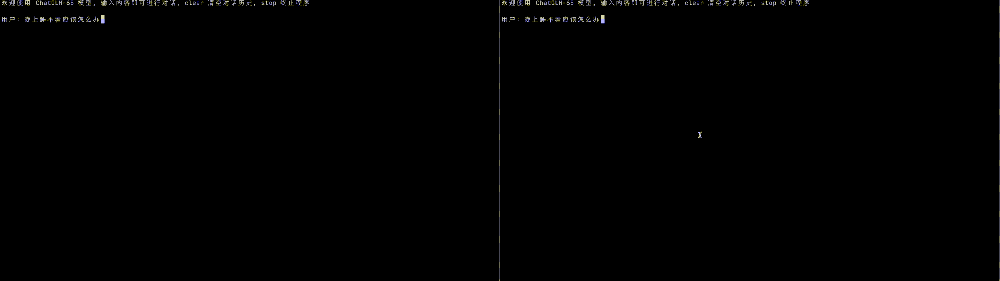

# faster-chatglm-6b

`faster-chatglm-6b` 是一个使用 [OneFlow](https://github.com/Oneflow-Inc/oneflow) 深度学习框架为后端加速[THUDM/chatglm-6b](https://huggingface.co/THUDM/chatglm-6b)运行的项目。



注：上图为加速效果展示，左侧为 OneFlow ，硬件为 NVIDIA A100 40G

## 软件依赖

请直接使用下面命令安装 OneFlow nightly CUDA 11.7 版本的安装包：

```shell
python3 -m pip install --pre oneflow -f https://staging.oneflow.info/branch/master/cu117
```

## 安装方式

下载或 clone 本项目后，在项目目录中运行：

```shell
python3 -m pip install -e .
```

或

```shell
python3 -m pip install git+https://github.com/Oneflow-Inc/faster-chatglm-6b.git
```

## 代码调用

```ipython
>>> import faster_chatglm_6b
>>> from transformers import AutoTokenizer, AutoModel
>>> tokenizer = AutoTokenizer.from_pretrained("THUDM/chatglm-6b", trust_remote_code=True)
>>> model = AutoModel.from_pretrained("THUDM/chatglm-6b", trust_remote_code=True).half().cuda()
>>> response, history = model.chat(tokenizer, "你好", history=[])
>>> print(response)
你好👋!我是人工智能助手 ChatGLM-6B,很高兴见到你,欢迎问我任何问题。
```

注意：这里和[THUDM/chatglm-6b 官方示例](https://huggingface.co/THUDM/chatglm-6b#%E4%BB%A3%E7%A0%81%E8%B0%83%E7%94%A8)不同的是，在官方示例的最前面增加了一行 `import faster_chatglm_6b`，这样就把后台切换成了 OneFlow。

下面解释一下，这一行代码主要发生了什么:

1. 设置 OneFlow 的一些环境变量，用于控制 OneFlow 框架的行为。
2. 使用 OneFlow 的 `mock_torch` 方法把所有的 PyTorch 模块替换成对应的 OneFlow 模块。
3. 利用 transformers 模块的动态模块工具，把找到的原 ChatGLM-6B 中的 `ChatGLMForConditionalGeneration` 模块替换成经过 OneFlow 优化的 `ChatGLMForConditionalGeneration` 模块。

这一行的详细行为，请参考 `faster_chatglm_6b/__init__.py`。

## 更多演示

我们模仿 https://github.com/THUDM/ChatGLM-6B 项目也提供了命令行和网页版的演示，请参考 `examples` 目录下的文件。

```shell
examples/
├── demo.py     # 单轮对话演示
├── cli_demo.py # 命令行多轮对话演示
└── web_demo.py # 网页版对话演示
```

## 原理分析

在前面的演示中，我们提到，通过增加了一行 `import faster_chatglm_6b`，就可以把ChatGLM运行的后台切换成 OneFlow，具体来说这一行代码：

1. 设置了 OneFlow 的一些环境变量，用于控制 OneFlow 框架的行为。
2. 使用 OneFlow 的 `mock_torch` 方法把所有的 PyTorch 模块替换成对应的 OneFlow 模块。
3. 利用 transformers 模块的动态模块工具，把找到的原 ChatGLM-6B 中的 `ChatGLMForConditionalGeneration` 模块替换成经过 OneFlow 优化的 `ChatGLMForConditionalGeneration` 模块。

详细行为，请参考 `faster_chatglm_6b/__init__.py`。

另外我们对ChatGLM骨干网的一些模块进行了优化，这些模块包括：

- fast_gelu

我们采用`fast_gelu`替换了`gelu_impl`的实现。

- fused_apply_rotary_emb

ChatGLM中，每一个GLMBlock层的SelfAttention模块，都需要对张量query_layer, key_layer进行旋转位置嵌入操作（Rotary Position Embedding），该操作根据当前位置和不同频率的偏移量将位置计算为一个矢量，然后将这个矢量应用于一个矩阵，该矩阵表示为由一组一个复数角度对组成的旋转矩阵。我们采用`fused_apply_rotary_emb`将上述运算放到一个kernel中完成。

- fused_attention_concat_past_key_value

我们将attention function中key和value与过去信息拼接的过程融合到一个`fused_attention_concat_past_key_value`中进行一次计算。

- fused_multi_head_attention_inference_v2

我们将多头注意力计算融合到`fused_multi_head_attention_inference_v2`中，包括了计算出每个query vector对应所有key vectors的注意力分数；对注意力分数进行缩放，使用softmax函数将其转换为注意力权重；使用注意力权重对所有value vectors进行加权求和等操作。

- fused_fast_gelu_mul

我们将`x1 * F.gelu(x2)`的操作融合成`fused_fast_gelu_mul`算子。

- fused_matmul_bias

我们使用`fused_matmul_bias`将`4h_to_h`的操作和第二个残差连接操作融合起来计算。

## 测试结果

我们对优化后的效果进行了定量的测试，测试脚本请参考：examples/benchmark.py。

测试在NVIDIA A100 40G中进行，一共测试了4组参数，每组参数都运行了5次，测试结果如下：

| Backend | Quantization | Duration(s) | average  |
| ------- | ------------ | ----------- | -------- |
| OneFlow | Disable      | 30.58       | 1.53s/it |
| OneFlow | Disable      | 30.96       | 1.55s/it |
| OneFlow | Disable      | 30.52       | 1.53s/it |
| OneFlow | Disable      | 31.13       | 1.56s/it |
| OneFlow | Disable      | 30.71       | 1.54s/it |
| OneFlow | Enable       | 33.30       | 1.66s/it |
| OneFlow | Enable       | 33.68       | 1.68s/it |
| OneFlow | Enable       | 26.06       | 1.30s/it |
| OneFlow | Enable       | 33.77       | 1.69s/it |
| OneFlow | Enable       | 29.30       | 1.46s/it |
| Torch   | Disable      | 110.65      | 5.53s/it |
| Torch   | Disable      | 112.23      | 5.61s/it |
| Torch   | Disable      | 135.04      | 6.75s/it |
| Torch   | Disable      | 109.02      | 5.45s/it |
| Torch   | Disable      | 114.88      | 5.74s/it |
| Torch   | Enable       | 161.77      | 8.09s/it |
| Torch   | Enable       | 162.93      | 8.15s/it |
| Torch   | Enable       | 185.70      | 9.29s/it |
| Torch   | Enable       | 159.99      | 8.00s/it |
| Torch   | Enable       | 161.69      | 8.08s/it |

## FAQ


## TODOs

1. OneFlow 支持 skip_init 功能之后，`faster_chatglm_6b/__init__.py`中移除`new_skip_init`。
2. 移除 `cli_demo.py` 和 `web_demo.py` 中对 `torch.no_grad` 的依赖。

